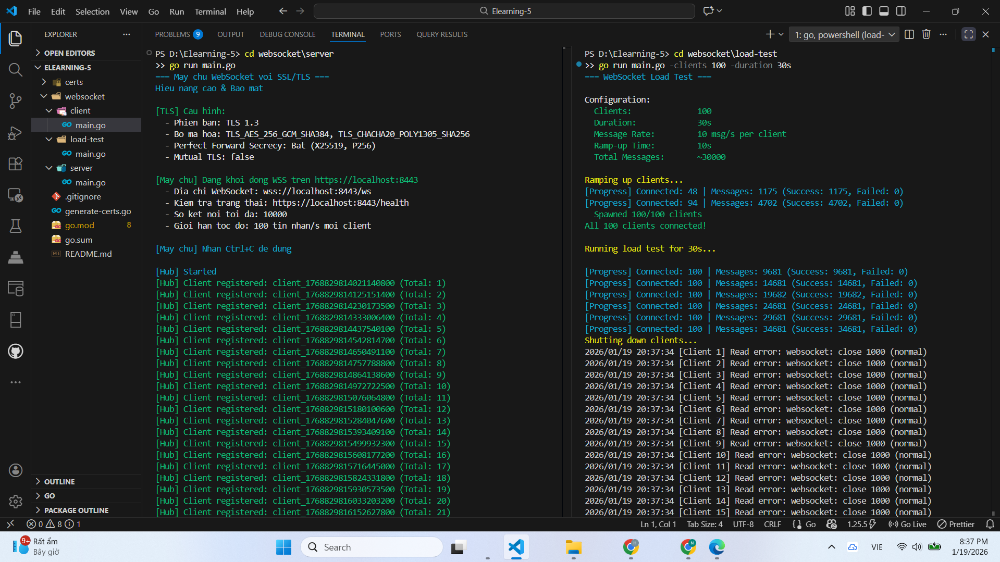
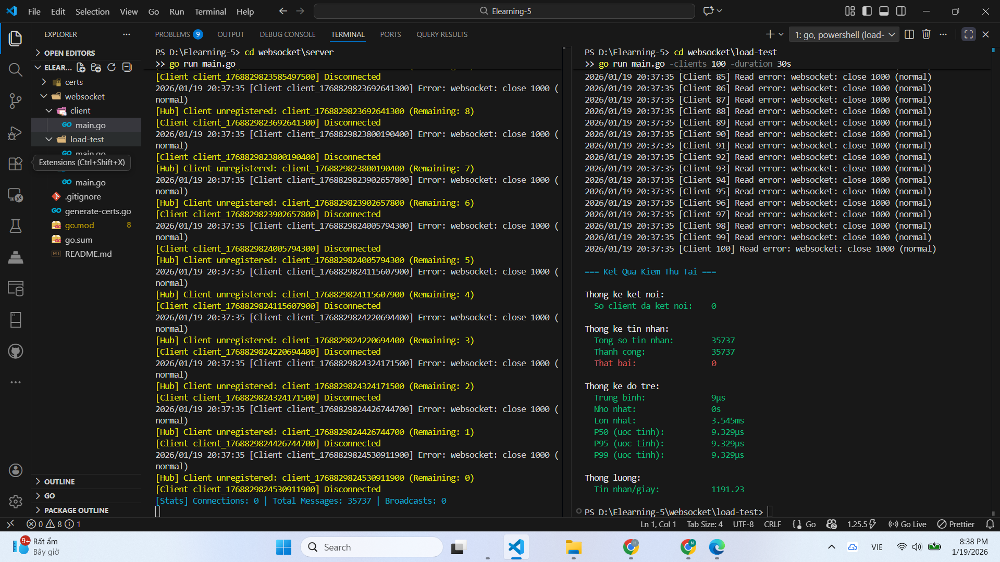

#  WebSocket Server Chịu Tải Cao với SSL/TLS
## Giới thiệu
Ứng dụng **WebSocket Server** hỗ trợ **10,000+ kết nối đồng thời** với bảo mật **SSL/TLS 1.3**.
**Công nghệ:** Golang + WebSocket + TLS 1.3
**Tính năng:**
- WebSocket Secure (WSS) với TLS 1.3
- Hỗ trợ 10,000+ kết nối đồng thời
- Rate limiting & connection pooling
- Perfect Forward Secrecy
- Load testing tool
---

##  Hướng Dẫn Chạy Dự Án

### Bước 1️: Tạo SSL Certificates
go run generate-certs.go

### Bước 2️: Chạy WebSocket Server
cd websocket\server
go run main.go
### Bước 3️: Test với Client
cd websocket\client
go run main.go
**Kết quả:** Client kết nối và gửi/nhận messages
### Bước 4️: Load Test (Tùy chọn)
```powershell
cd websocket\load-test
go run main.go -clients 100 -duration 30s
```
**Tham số:**
- `-clients`: Số lượng client đồng thời (mặc định: 100)
- `-duration`: Thời gian test (mặc định: 60s)
- `-message-rate`: Số message/giây mỗi client (mặc định: 10)

**Ví dụ test nặng:**
```powershell
go run main.go -clients 1000 -duration 60s -message-rate 20
```
---
## Cấu Trúc Dự Án

```
Elearning-5/
├── generate-certs.go          # Tool tạo SSL certificates
├── go.mod                      # Dependencies
│
├── certs/                      # SSL Certificates (auto-generated)
│   ├── ca/                     # Certificate Authority
│   ├── server/                 # Server certificates
│   └── client/                 # Client certificates
│
└── websocket/
    ├── server/                 # WebSocket Server
    │   └── main.go
    ├── client/                 # WebSocket Client
    │   └── main.go
    └── load-test/              # Load Testing Tool
        └── main.go
```
KẾT QUẢ:

